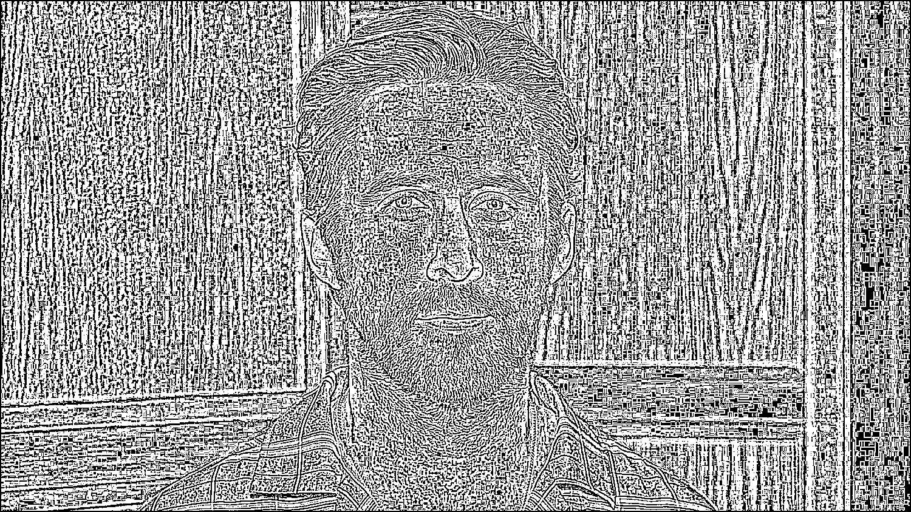
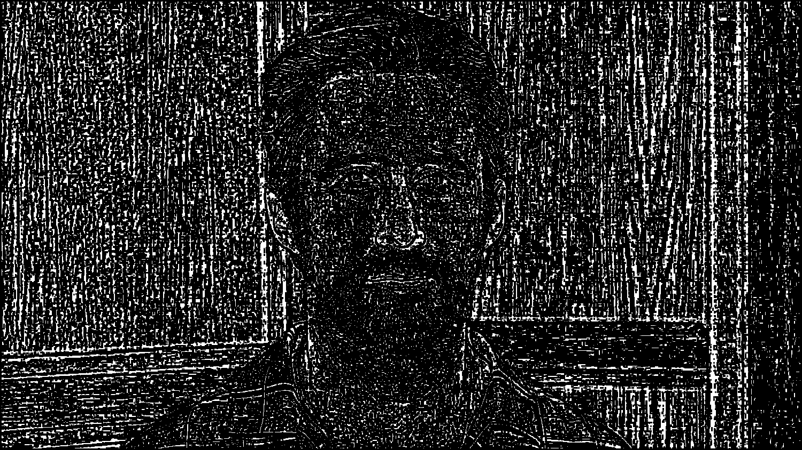
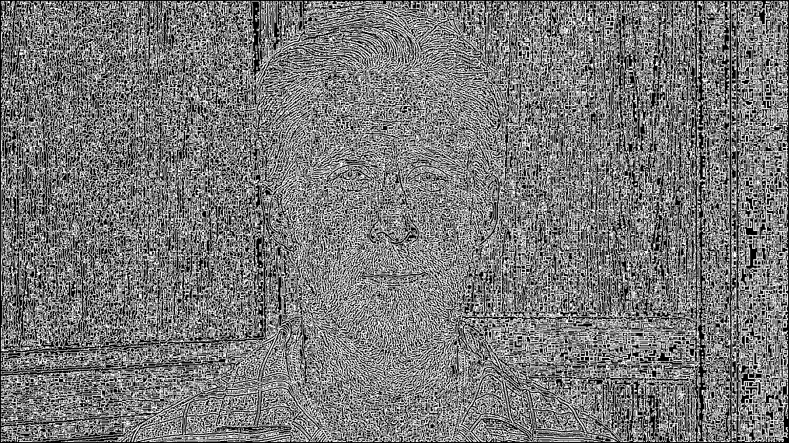
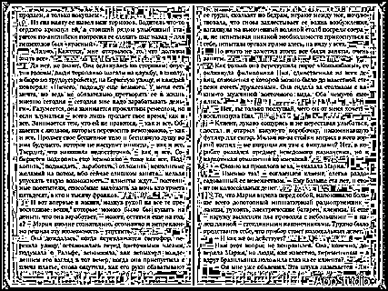
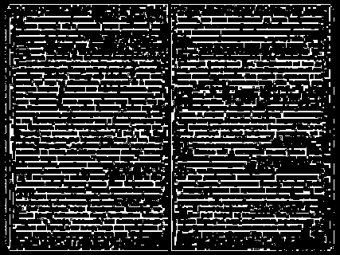
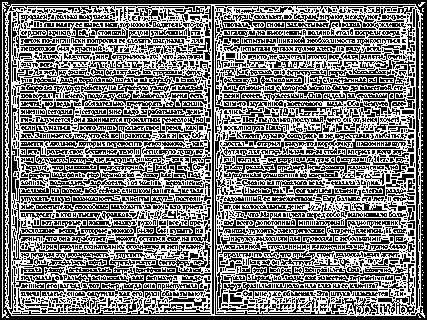
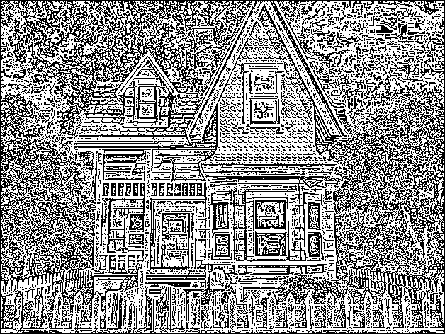
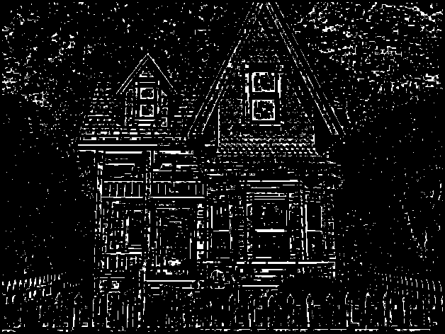
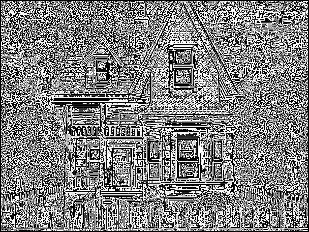

# Лабораторная работа: Фильтрация изображений и морфологические операции

## Задание

В данной лабораторной работе была выполнена фильтрация монохромных (полутоновых) изображений с использованием морфологического расширения (дилатации) и кольцевого структурирующего элемента с окном 3x3. В качестве исходных данных использовались монохромные изображения, на которых были применены морфологические операции, а также было создано разностное изображение с использованием операции XOR или модуля разности.

### Структурирующий элемент
- Структурирующий элемент: кольцо 3x3.
- Морфологическое сжатие (эрозия).
Структурирующий элемент — кольцо

### Методы обработки изображений:
1. Применение морфологического расширения для увеличения светлых областей изображения.
2. Создание разностного изображения (модуль разности или XOR).
3. Применение пороговой фильтрации для выделения ключевых областей изображения.

## Исходные изображения

### Пример 1

#### Исходное изображение

#### После применения фильтрации (морфологическое сжатие)

#### Разностное изображение (после обработки)

### Бинаризация

### Пример 2

#### Исходное изображение

#### После применения фильтрации (морфологическое сжатие)

#### Разностное изображение (после обработки)

### Бинаризация

### Пример 3

#### Исходное изображение

#### После применения фильтрации (морфологическое сжатие)

#### Разностное изображение (после обработки)

### Бинаризация

## Выводы

1. **Дилатация (морфологическое сжатие)** увеличивает размеры светлых областей изображения, что позволяет выделить основные контуры и формы объектов.
2. **Разностное изображение** демонстрирует изменения, внесенные в изображение после применения дилатации. Метод позволяет анализировать выделенные области и обнаруживать различия.
3. **Пороговая фильтрация** помогает устранить незначительные детали и усилить важные контуры, что особенно полезно при анализе текстовых и графических изображений.

## Заключение

Морфологическое сжатие может быть полезным для обработки изображений с размытыми или нечеткими границами, а также для подготовки данных перед дальнейшим анализом.